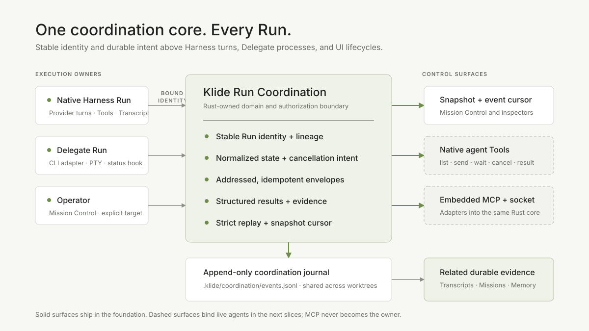
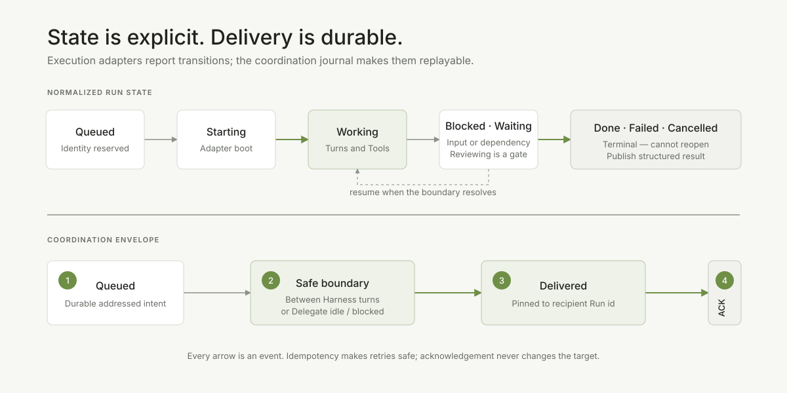

# Klide Agent Coordination

Klide owns inter-agent communication. It does not delegate identity, routing,
state, authorization, or durable delivery to an external service. MCP, a local
socket, and terminal-specific integrations are adapters into the same Rust
domain.



## Product promise

Every Run has a stable address. Coordinators can see whether it is working,
blocked, waiting, reviewing, or finished; send durable instructions and
questions; request cancellation; and receive a structured result with evidence.
The focused panel and a terminal's last line never decide identity or truth.

The design combines two useful patterns without adding a provider dependency:

- [Herdr](https://github.com/herdrdev/herdr) demonstrates process-owned agent
  identity, snapshot-plus-events clients, and atomic prompt/wait semantics.
- [Muse Code fan-out](https://github.com/meta-models/meta-model-cookbook/blob/main/04_muse_code/06_subagent_fanout/README.md)
  demonstrates explicit spawn, track, steer, stop, wait, and admit controls with
  isolated worktrees for write-capable agents.

Klide's Run and Mission vocabulary remains the domain. These projects are
design references, not runtime dependencies.

## Ownership boundary

| Layer | Owns | Does not own |
|---|---|---|
| Harness / Delegate adapter | Model turns, Tools, process lifetime, safe delivery boundary | Global inboxes or routing policy |
| Run coordination | Stable identity, normalized state, authorization, envelopes, cancellation intent, results, replay | Provider streaming or terminal emulation |
| Transcript | Detailed evidence emitted by one Run | Cross-Run delivery |
| Mission | Task graph, acceptance, attempt admission | Direct semantic transport |
| Project Memory | Reviewed reusable knowledge | Unreviewed coordination traffic |
| React | Snapshot presentation and operator input | Durable state or target selection by focus |

## Durable authority

One Workspace has one append-only journal:

```text
<main-checkout>/.klide/coordination/events.jsonl
```

Private Git worktrees resolve back to the checkout that owns the real `.git`
directory. A parent Run and write-isolated children therefore share one journal
without sharing one working tree. Reads never create `.klide/coordination/`;
the first accepted command creates it.

Each event line carries `schemaVersion`, a contiguous `seq`, a timestamp, and a
typed event. Replay is strict: malformed JSON, sequence gaps, future schema
versions, invalid lineage, illegal state transitions, unknown envelopes, or
impossible delivery transitions fail visibly. Klide never skips a damaged line
and invents a partial coordination state.

## Foundation command seam

The Rust core accepts provider-neutral supervisor commands:

| Command | Durable effect |
|---|---|
| `register_run` | Registers immutable Run identity, worker kind, lineage, and optional Mission link |
| `set_run_state` | Appends a validated normalized state transition |
| `send_envelope` | Queues an addressed semantic payload with correlation and evidence |
| `mark_envelope_delivered` | Records safe-boundary delivery to the addressed Run |
| `acknowledge_envelope` | Records that the recipient consumed the envelope |
| `request_cancel` | Records authorized cancellation intent |
| `publish_result` | Publishes one structured Run outcome and its artifacts |

This generic command seam is trusted local supervisor IPC. An MCP or socket
adapter must authenticate its caller and construct the actor in Rust. It must
never pass through an arbitrary remote `actor` field.

## Authorization

- The operator may address, transition, or request cancellation for any
  registered Run in the open Workspace.
- A Run may publish normalized state only for itself.
- A Run may exchange envelopes with itself, its direct parent or children, and
  other Runs attached to the same Mission.
- A Run may request cancellation only for itself or a direct child.
- Registration requires an existing parent, preventing cycles and ambiguous
  lineage.
- Mission Runs carry both `missionId` and `missionTaskId`, or neither.

Adapter authentication will narrow this further; the domain never expands it.

## Delivery semantics



An envelope progresses monotonically:

```text
queued → delivered → acknowledged
```

Transport is at-least-once. `idempotencyKey` makes retries safe, while the
journal gives each accepted intent exactly one projection. The recipient Run
id is immutable, so a replacement process, panel, or Delegate session cannot
accidentally satisfy another Run's delivery.

This foundation records the lifecycle but does not yet inject an envelope into
a live model turn. The Harness integration must deliver only between provider
turns, never during streaming or Tool execution. Delegate adapters must wait
for an idle/blocked boundary and record the semantic delivery separately from
the PTY bytes used to perform it.

## Snapshot and event cursors

Consumers follow one race-free pattern:

1. Call `coordination_snapshot`.
2. Render its Runs, envelopes, cancellations, and results.
3. Read `coordination_events` from the snapshot's inclusive `nextSeq` cursor.
4. Fold returned events and continue from the next cursor.

React can remount, an MCP connection can reconnect, and Klide can restart
without losing the coordination model. The journal, not an in-memory bus, is
the recovery contract.

## Result versus memory

A Coordination result is the Run's structured report:

- terminal or partial status;
- concise summary;
- files, commits, diffs, Transcripts, or Memory artifacts;
- source references back to evidence.

It may feed a Mission dependency or a Project Memory draft. It is not itself
Project Memory. Reusable knowledge still crosses the explicit review boundary
owned by the Memory Engine.

## PR sequence

### PR 1 — Coordination foundation

- Rust-owned command/event model and strict append-only replay;
- normalized Run state and lineage-scoped authorization;
- durable, idempotent envelope delivery projection;
- cancellation intent and structured results;
- snapshot and cursor-based event commands;
- main-checkout store resolution for private worktrees;
- TypeScript wire mirror, JSON Schemas, tests, and website-ready visuals.

### PR 2 — Native Harness integration

- register native Runs and publish state from Agent events;
- add lineage-scoped `agent_list`, `agent_send`, `agent_wait`,
  `agent_cancel`, and `agent_read_result` Tools;
- inject queued envelopes only at safe turn boundaries;
- atomically send-and-wait with correlation ids;
- auto-deliver child results when the parent reaches a safe boundary.

### PR 3 — Write-capable children and Missions

- give every write-capable child a private branch and Git worktree;
- expose steering, cancellation, status, and result admission in Mission
  Control;
- attach accepted predecessor results to dependent Task prompts;
- validate and admit artifacts before merge.

### PR 4 — Embedded MCP and Delegate adapters

- expose identity-bound list/send/wait/result Tools over embedded MCP;
- map Delegate idle/blocked status into normalized state;
- add a local socket/CLI over the same Rust core when needed;
- use PTY input only as an adapter implementation detail;
- add protocol conformance, reconnect, and duplicate-delivery tests.

## Foundation success criteria

- A fresh process reconstructs the same snapshot solely from the journal.
- Private worktrees share one inbox without sharing file mutations.
- Unrelated Runs cannot message or cancel one another.
- Duplicate retries do not append duplicate envelopes or results.
- Only the addressed Run can deliver and acknowledge an envelope.
- Terminal state cannot reopen.
- Corrupt or logically impossible journals fail closed.
